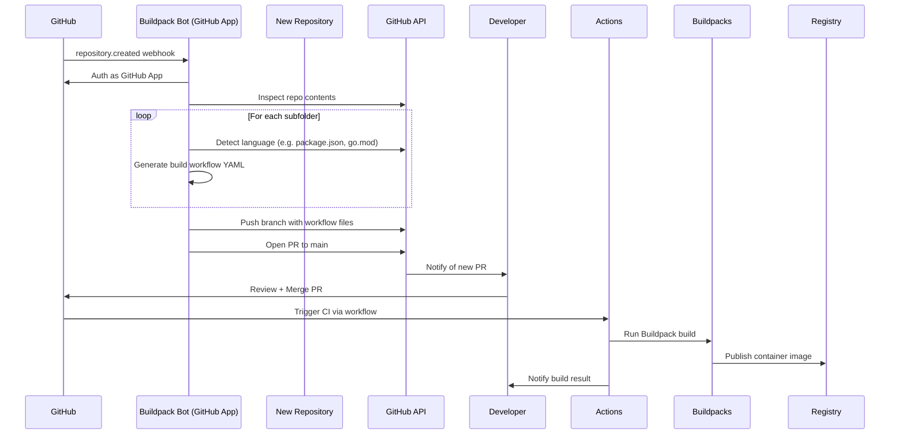

# 🤖 Buildpack Automation Bot

**Auto-detect. Auto-wire. Auto-build.**

> The Buildpack Automation Bot is a GitHub App that automatically configures CNCF Buildpacks for new and existing repositories, discovers buildable subfolders, and generates GitHub Actions CI workflows—all without requiring developers to write a single line of CI configuration.

---

## ✨ What It Does

Buildpack Automation Bot brings instant DevOps readiness to your repositories. Once installed in a GitHub organization:

- 🧠 **Detects language & framework** of new codebases (e.g. Node.js, Python, Go, Java)
- 📁 **Scans for sub-applications** in multi-service repositories
- ⚙️ **Generates GitHub Actions workflows** using Cloud Native Buildpacks
- 🔀 **Creates pull requests** with all necessary build and deployment files
- 📬 **Notifies teams** of changes and build status (optional Slack/MS Teams integration)
- 🧪 **Enables reproducible container builds** without Dockerfiles

Whether you're standardizing builds across dozens of teams or onboarding a new repo, the Buildpack Bot gives you a fast, repeatable, secure way to go from code to container.

---

## 🚀 Key Features

| Feature                        | Description |
|-------------------------------|-------------|
| 🧾 **New Repo Detection**      | Hooks into GitHub's `repository.created` webhook to initialize builds on day one. |
| 🔍 **Subfolder Discovery**     | Recursively inspects subdirectories for buildable applications. |
| 🧠 **Language Heuristics**     | Uses file-based detection (`package.json`, `go.mod`, `pyproject.toml`, etc.) to identify stacks. |
| ⚙️ **CI Workflow Injection**   | Adds `.github/workflows/<app>-build.yml` with preconfigured Buildpack steps. |
| 📦 **Pack CLI / Actions**      | Uses CNCF Buildpacks and Paketo builders to generate secure, production-grade container images. |
| 📝 **PR-Based Delivery**       | All automation changes are delivered via Pull Requests for auditability and review. |
| ✋ **Manual Subscription**     | Use a `/setup-buildpacks` comment or API to migrate existing repositories. |
| 🕵️ **Scheduled Folder Rescan**| Detects and wires in new applications added to an existing repo over time. |

---

## 🛠 Architecture Overview



📦 Sample Generated Workflow
```yaml
name: Build and Publish Container

on:
  push:
    paths:
      - 'apps/web/**'
    branches: [main]

jobs:
  build:
    runs-on: ubuntu-latest
    steps:
      - uses: actions/checkout@v4
      - uses: buildpacks/github-actions/setup-pack@v5
      - run: pack build ghcr.io/my-org/web --builder paketobuildpacks/builder:base
```

🧩 How to Use

🔌 Install the Bot
Visit the GitHub App installation page (coming soon).

Select repositories or apply org-wide.

The bot will begin listening for new repos and pull requests.

🛠 On-Demand Setup
For existing repositories:

```bash
gh issue comment --repo my-org/my-repo --body "/setup-buildpacks"
This will trigger the bot to scan the repository and open a PR with relevant build configurations.
```

🧪 Supported Stacks

| Language | Detection File(s)                   | Status      |
| -------- | ----------------------------------- | ----------- |
| Node.js  | `package.json`                      | ✅ Ready     |
| Python   | `pyproject.toml`/`requirements.txt` | ✅ Ready     |
| Go       | `go.mod`                            | ✅ Ready     |
| Java     | `pom.xml`, `build.gradle`           | ✅ Ready     |
| Ruby     | `Gemfile`                           | 🔜 Planned  |
| PHP      | `composer.json`                     | 🔜 Planned  |
| Polyglot | Detected per subfolder              | ✅ Supported |


👨‍💻 Who Should Use This?
- Platform Engineering: To enforce standardized build pipelines across repos.
- DevOps: To accelerate containerization and CI/CD adoption.
- Developers: To save time configuring CI pipelines and focus on coding.
- Release Managers: To reduce inconsistency in build processes.

📊 Roadmap (Preview)
- Auto-inject workflows into new repos
- Multi-folder discovery support
- Manual subscription via comment/CLI
- GitHub App UI for install/configuration
- Monorepo dependency resolution
- Advanced metrics (PR merge rate, build pass rate, etc.)
- Terraform output for team-wide policy enforcement

🧠 Design Principles
- GitOps First: All changes proposed as pull requests, never committed directly.
- Secure Builds: Containers built using hardened, minimal Paketo builders.
- Language Agnostic: Uses Buildpacks to support a wide range of app stacks.
- Extensible: Designed to support additional CI systems, registries, or custom build logic.

💬 Community and Feedback
- Have suggestions, ideas, or feedback?
= File an issue or discussion on GitHub

Contact us via Discussions on this project!

📄 License
MIT © Microscaler. Contributions welcome.


